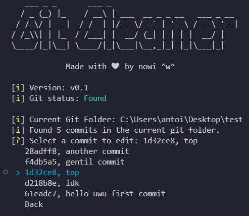

<!-- markdownlint-disable MD033 MD041 MD007 -->

<!-- pretty badges -->
<div align="center">
  
  
  
</div>

# ✏️ Git Cleaner

Welcome to the **Git Cleaner**!

<p align="center">
  
</p>

## 📜 Description

...

## 🚀 Features

...

## ⚙️ Installation

1. Clone the repository:

    ```bash
    git clone https://github.com/Ant0in/GitCleaner
    cd GitCleaner
    ```

2. Set up a **virtual environment**:

    ```bash
    python3 -m venv venv
    source venv/bin/activate  # On Windows: venv\Scripts\activate
    ```

3. Install the required dependencies:

    ```bash
    pip install -r requirements.txt
    ```

4. If you don't have `requirements.txt`, you can manually install **inquirer**

    ```bash
    pip install inquirer
    ```

## 🛠️ Usage

### Running the App

To run the app, you can use the following:

```bash
python3 src/main.py
```

## 📄 License

This project is licensed under the **MIT License**. See the [LICENSE](LICENSE) file for more details.
